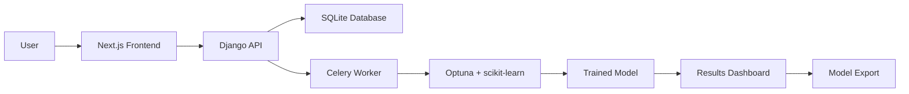

# 🤖 AutoML Studio: AI-Based No-Code Machine Learning Platform

[](https://python.org)
[](https://djangoproject.com)
[](https://nextjs.org)
[](LICENSE)

An **AI-powered, no-code web platform** that automates the entire machine learning workflow — from dataset upload to optimized model export — without writing a single line of code.

> **"Democratizing machine learning for analysts, researchers, students, and domain experts."**

---

## 🌟 Features

✅ **No-Code Interface**
&nbsp;&nbsp;&nbsp;&nbsp;– Intuitive UI for non-programmers
&nbsp;&nbsp;&nbsp;&nbsp;– Step-by-step guided workflow

✅ **Smart Pipeline Recommendation**
&nbsp;&nbsp;&nbsp;&nbsp;– AI analyzes your dataset + description
&nbsp;&nbsp;&nbsp;&nbsp;– Recommends top pipelines (preprocessing → algorithm)

✅ **Automated Training & Optimization**
&nbsp;&nbsp;&nbsp;&nbsp;– Train multiple candidate pipelines
&nbsp;&nbsp;&nbsp;&nbsp;– Bayesian hyperparameter tuning (Optuna)
&nbsp;&nbsp;&nbsp;&nbsp;– Task-specific evaluation (classification/clustering/regression)

✅ **Transparent Results**
&nbsp;&nbsp;&nbsp;&nbsp;– Performance metrics & visualizations
&nbsp;&nbsp;&nbsp;&nbsp;– Confusion matrix, feature importance, convergence plots

✅ **One-Click Export**
&nbsp;&nbsp;&nbsp;&nbsp;– Download models as `.pkl`, `.onnx`, or Python script

✅ **Full User Flow Support**
&nbsp;&nbsp;&nbsp;&nbsp;– Model selection → Upload → Describe → Analyze → Recommend → Train → Optimize → Export

---

## 🏗️ Architecture

### Frontend (`/frontend`)
- **Framework**: Next.js 14 (App Router)
- **Styling**: Tailwind CSS + Framer Motion
- **State**: React Context
- **Port**: 3000

### Backend (`/`)
- **Framework**: Django 4.2 + Django REST Framework
- **Async Tasks**: Celery + Redis
- **Database**: SQLite (development)
- **ML Engine**: Python (scikit-learn, XGBoost, Optuna)
- **Port**: 8000

### Core Workflow


---

## 🚀 Quick Start

### Prerequisites
- Python 3.10+
- Node.js 18+
- Redis (for Celery)

### Installation

1. **Clone the repository**
   ```bash
   git clone <repository-url>
   cd MCAFINAL
   ```

2. **Install Python dependencies**
   ```bash
   python -m venv .venv
   .venv\Scripts\activate  # Windows
   source .venv/bin/activate  # Linux/Mac
   pip install -r requirements.txt
   ```

3. **Install Node.js dependencies**
   ```bash
   cd frontend
   npm install
   cd ..
   ```

4. **Start Redis** (required for Celery)
   ```bash
   # Windows: Download from https://github.com/microsoftarchive/redis/releases
   # Linux/Mac:
   redis-server
   ```

### Running the Application

**Start all services:**

Windows PowerShell:
```powershell
.\start.ps1
```

**Or start services manually in separate terminals:**

Windows PowerShell:
```powershell
# Terminal 1: Django Backend
python manage.py runserver 8000

# Terminal 2: Celery Worker
python -m celery -A mlplatform worker --loglevel=info --pool=solo

# Terminal 3: Next.js Frontend
cd frontend && npm run dev
```

### Access the Application

Open your browser and navigate to:
- **Frontend**: http://localhost:3000
- **Backend API**: http://localhost:8000/api/
- **Django Admin**: http://localhost:8000/admin/

---

## 📁 Project Structure

```
MCAFINAL/
├── frontend/           # Next.js frontend application
├── api/               # Django API endpoints
├── users/             # User authentication & profiles
├── datasets/          # Dataset management
├── training/          # ML training engine
├── pipelines/         # ML pipeline definitions
├── mlplatform/        # Django project settings
└── start.ps1          # Windows startup script (all services)
```
