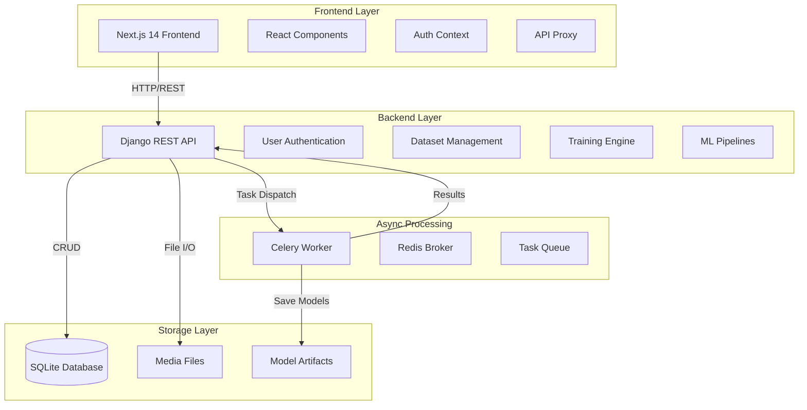
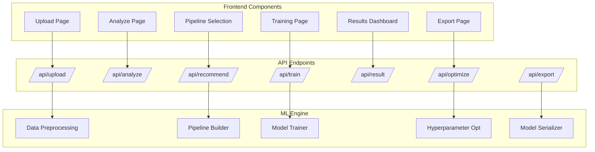
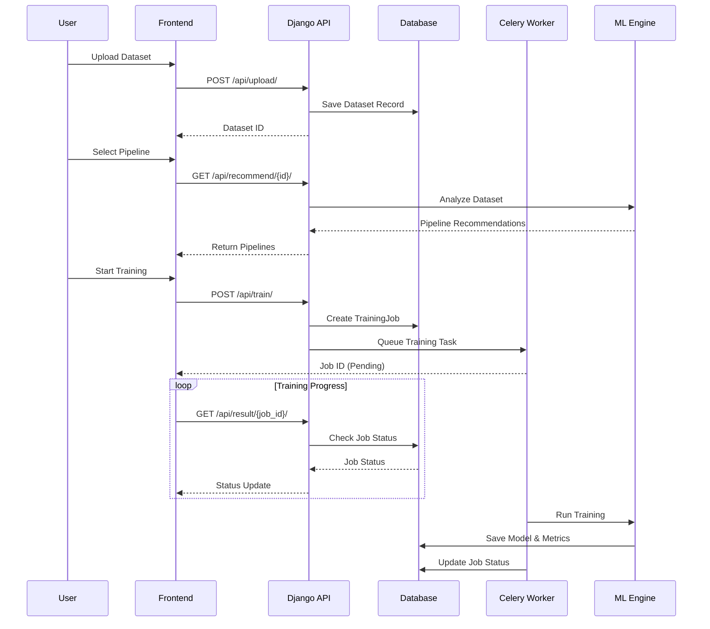
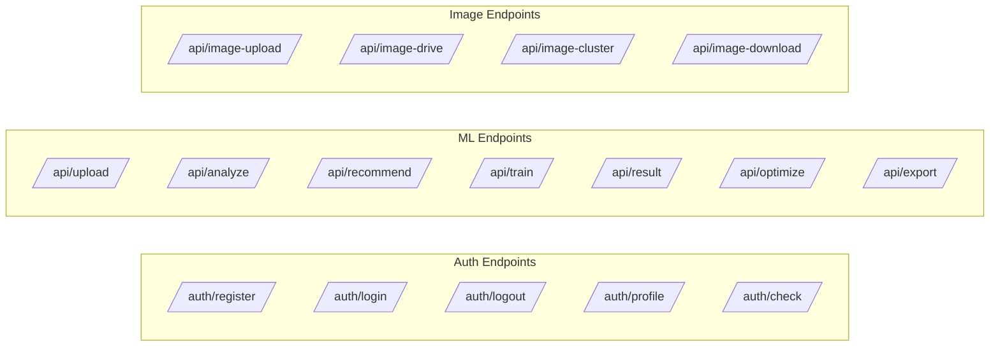
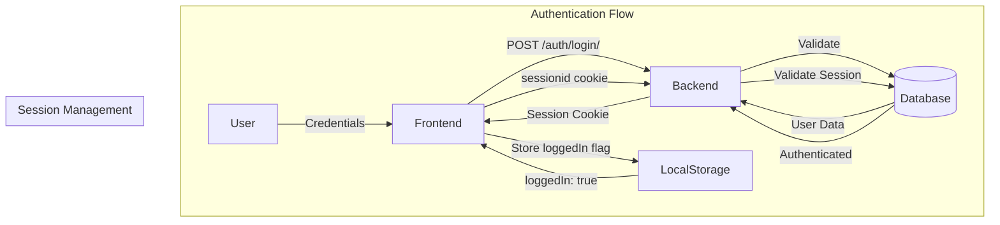
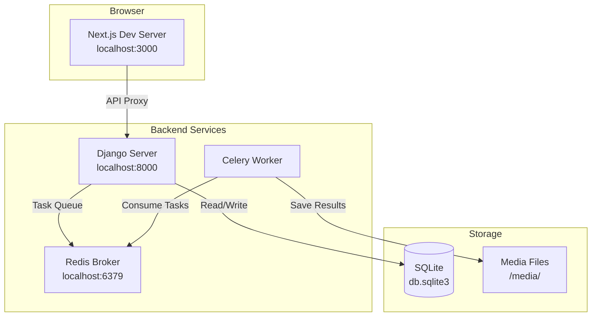

# System Architecture - AutoML Studio

## Overview

AutoML Studio is a no-code machine learning platform that automates the entire ML workflow from dataset upload to model export.

---

## High-Level Architecture

---

## Component Architecture

---

## Data Flow Architecture

---

## Technology Stack

| Layer | Technology | Purpose |
|-------|-----------|---------|
| **Frontend** | Next.js 14 | React framework with App Router |
| **Styling** | Tailwind CSS + Framer Motion | UI components and animations |
| **State** | React Context API | Authentication and global state |
| **Backend** | Django 4.2 + DRF | REST API and business logic |
| **Database** | SQLite (dev) | Data persistence |
| **Task Queue** | Celery + Redis | Async ML training |
| **ML Libraries** | scikit-learn, XGBoost, Optuna | Model training and optimization |
| **AI** | OpenRouter (Gemini) | Pipeline recommendations |

---

## API Architecture

---

## Security Architecture

---

## Deployment Architecture (Local Development)

---

## Key Design Decisions

1. **API Proxy Pattern**: Next.js proxies all `/api/*` requests to Django, simplifying CORS
2. **Session-Based Auth**: Uses Django sessions with localStorage flags for persistence
3. **Async Processing**: Celery handles long-running ML tasks without blocking requests
4. **CSRF Exemption**: Custom authentication class bypasses CSRF for API endpoints
5. **JSON Fields**: Flexible schema for ML metrics, hyperparameters, and pipeline configs
