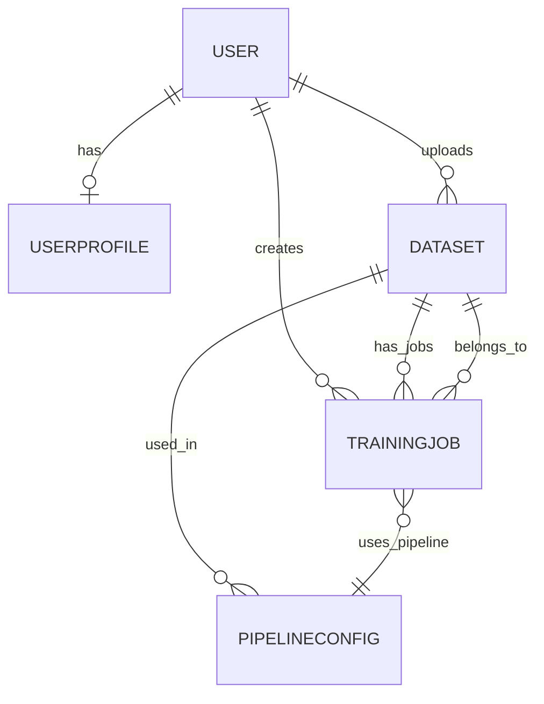
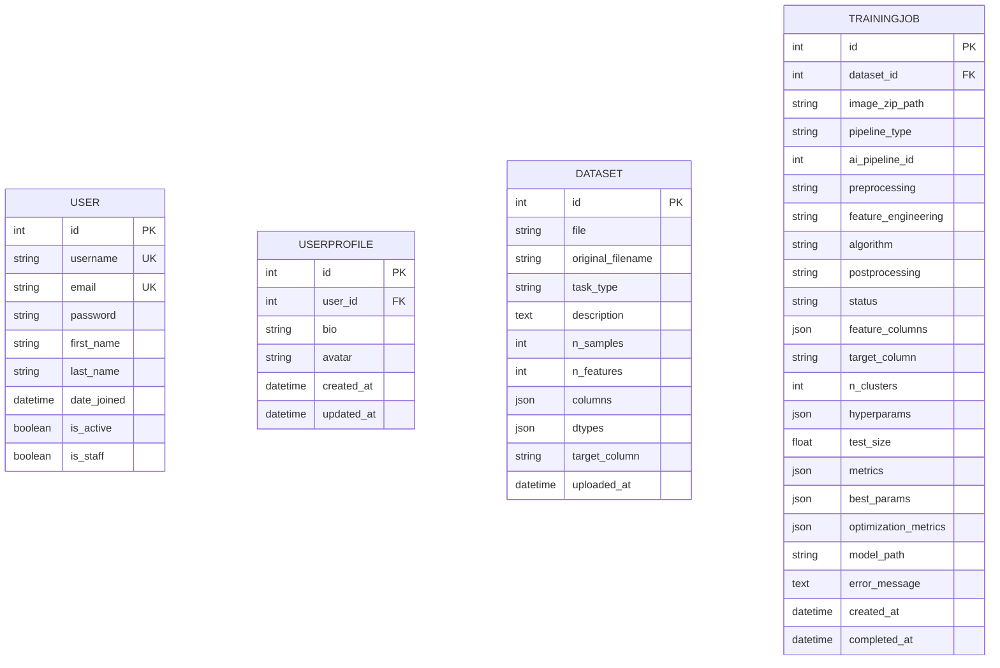
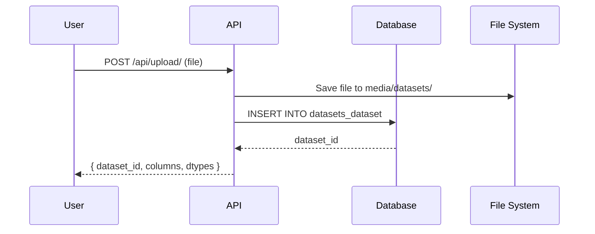
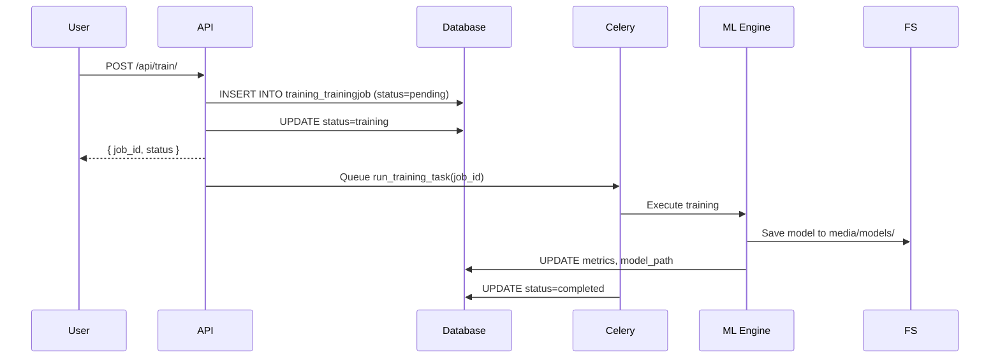

# Entity Relationship Diagram - AutoML Studio

## Database Schema

### ER Diagram



---

## Detailed Entity Model



---

## Physical Data Model

```mermaid
classDiagram
    class auth_user {
        +id : Integer [PK]
        +username : VARCHAR(150) [UK]
        +email : VARCHAR(254) [UK]
        +password : VARCHAR(128)
        +first_name : VARCHAR(150)
        +last_name : VARCHAR(150)
        +is_staff : BOOLEAN
        +is_active : BOOLEAN
        +date_joined : DATETIME
        +last_login : DATETIME
    }

    class users_userprofile {
        +id : Integer [PK]
        +user_id : Integer [FK]
        +bio : TEXT
        +avatar : VARCHAR(100)
        +created_at : DATETIME
        +updated_at : DATETIME
    }

    class datasets_dataset {
        +id : Integer [PK]
        +file : VARCHAR(100)
        +original_filename : VARCHAR(255)
        +task_type : VARCHAR(20)
        +description : TEXT
        +n_samples : Integer
        +n_features : Integer
        +columns : JSON
        +dtypes : JSON
        +target_column : VARCHAR(255)
        +uploaded_at : DATETIME
    }

    class training_trainingjob {
        +id : Integer [PK]
        +dataset_id : Integer [FK]
        +image_zip_path : VARCHAR(500)
        +pipeline_type : VARCHAR(10)
        +ai_pipeline_id : Integer
        +preprocessing : VARCHAR(100)
        +feature_engineering : VARCHAR(100)
        +algorithm : VARCHAR(100)
        +postprocessing : VARCHAR(100)
        +status : VARCHAR(20)
        +feature_columns : JSON
        +target_column : VARCHAR(255)
        +n_clusters : Integer
        +hyperparams : JSON
        +test_size : Float
        +metrics : JSON
        +best_params : JSON
        +optimization_metrics : JSON
        +model_path : VARCHAR(500)
        +error_message : TEXT
        +created_at : DATETIME
        +completed_at : DATETIME
    }

    auth_user ||--o{ users_userprofile : "1:1"
    auth_user ||--o{ datasets_dataset : "1:N"
    auth_user ||--o{ training_trainingjob : "1:N"
    datasets_dataset ||--o{ training_trainingjob : "1:N"
```

---

## Table Specifications

### `auth_user` (Django Built-in)

| Column | Type | Constraints | Description |
|--------|------|-------------|-------------|
| id | INTEGER | PRIMARY KEY, AUTO | Unique user ID |
| username | VARCHAR(150) | UNIQUE, NOT NULL | Login username |
| email | VARCHAR(254) | UNIQUE, NOT NULL | User email |
| password | VARCHAR(128) | NOT NULL | Hashed password |
| first_name | VARCHAR(150) | | First name |
| last_name | VARCHAR(150) | | Last name |
| is_staff | BOOLEAN | DEFAULT FALSE | Admin access |
| is_active | BOOLEAN | DEFAULT TRUE | Account active |
| date_joined | DATETIME | DEFAULT NOW | Registration date |
| last_login | DATETIME | | Last login time |

---

### `users_userprofile`

| Column | Type | Constraints | Description |
|--------|------|-------------|-------------|
| id | INTEGER | PRIMARY KEY, AUTO | Unique profile ID |
| user_id | INTEGER | FOREIGN KEY → auth_user.id | Linked user |
| bio | TEXT | NULLABLE | User biography |
| avatar | VARCHAR(100) | NULLABLE | Profile picture path |
| created_at | DATETIME | DEFAULT NOW | Profile creation |
| updated_at | DATETIME | AUTO UPDATE | Last update |

---

### `datasets_dataset`

| Column | Type | Constraints | Description |
|--------|------|-------------|-------------|
| id | INTEGER | PRIMARY KEY, AUTO | Unique dataset ID |
| file | VARCHAR(100) | NOT NULL | File path in media/ |
| original_filename | VARCHAR(255) | NOT NULL | Original file name |
| task_type | VARCHAR(20) | NOT NULL | classification/regression/clustering |
| description | TEXT | NULLABLE | User description |
| n_samples | INTEGER | NULLABLE | Row count |
| n_features | INTEGER | NULLABLE | Column count |
| columns | JSON | NULLABLE | Column names array |
| dtypes | JSON | NULLABLE | Column data types |
| target_column | VARCHAR(255) | NULLABLE | Target variable |
| uploaded_at | DATETIME | DEFAULT NOW | Upload timestamp |

---

### `training_trainingjob`

| Column | Type | Constraints | Description |
|--------|------|-------------|-------------|
| id | INTEGER | PRIMARY KEY, AUTO | Unique job ID |
| dataset_id | INTEGER | FOREIGN KEY → datasets_dataset.id | Source dataset |
| image_zip_path | VARCHAR(500) | NULLABLE | Image zip for clustering |
| pipeline_type | VARCHAR(10) | DEFAULT 'custom' | 'ai' or 'custom' |
| ai_pipeline_id | INTEGER | NULLABLE | Selected AI pipeline ID |
| preprocessing | VARCHAR(100) | NULLABLE | Scaler type |
| feature_engineering | VARCHAR(100) | NULLABLE | Feature method |
| algorithm | VARCHAR(100) | NOT NULL | ML algorithm name |
| postprocessing | VARCHAR(100) | NULLABLE | Post-process method |
| status | VARCHAR(20) | DEFAULT 'pending' | pending/training/completed/failed |
| feature_columns | JSON | NULLABLE | Selected features |
| target_column | VARCHAR(255) | NULLABLE | Target variable |
| n_clusters | INTEGER | DEFAULT 3 | For clustering |
| hyperparams | JSON | NULLABLE | Model hyperparameters |
| test_size | FLOAT | DEFAULT 0.2 | Train/test split |
| metrics | JSON | NULLABLE | Performance metrics |
| best_params | JSON | NULLABLE | Optimized parameters |
| optimization_metrics | JSON | NULLABLE | Optuna results |
| model_path | VARCHAR(500) | NULLABLE | Saved model path |
| error_message | TEXT | NULLABLE | Error details |
| created_at | DATETIME | DEFAULT NOW | Job creation time |
| completed_at | DATETIME | NULLABLE | Completion time |

---

## Relationships

| Relationship | Type | Description |
|-------------|------|-------------|
| User → UserProfile | One-to-One | Each user has one profile |
| User → Dataset | One-to-Many | User can upload multiple datasets |
| User → TrainingJob | One-to-Many | User can create multiple training jobs |
| Dataset → TrainingJob | One-to-Many | Dataset can have multiple training jobs |

---

## Indexes

```sql
-- Auto-created by Django
CREATE INDEX datasets_dataset_uploaded_at ON datasets_dataset(uploaded_at);
CREATE INDEX training_trainingjob_status ON training_trainingjob(status);
CREATE INDEX training_trainingjob_created_at ON training_trainingjob(created_at);
CREATE INDEX training_trainingjob_dataset_id ON training_trainingjob(dataset_id);
CREATE INDEX users_userprofile_user_id ON users_userprofile(user_id);
```

---

## Data Flow Examples

### 1. Dataset Upload Flow



### 2. Training Job Flow



---

## Constraints & Validations

### Dataset Model
- `task_type` must be: 'classification', 'regression', or 'clustering'
- `file` must be .csv, .xlsx, or .xls
- `target_column` must exist in `columns` array

### TrainingJob Model
- `status` must be: 'pending', 'training', 'optimizing', 'completed', or 'failed'
- `pipeline_type` must be: 'ai' or 'custom'
- `test_size` must be between 0.1 and 0.4
- `dataset_id` is required for tabular data (nullable for image clustering)
