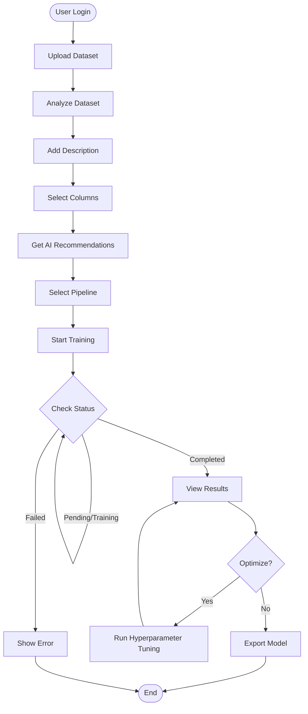
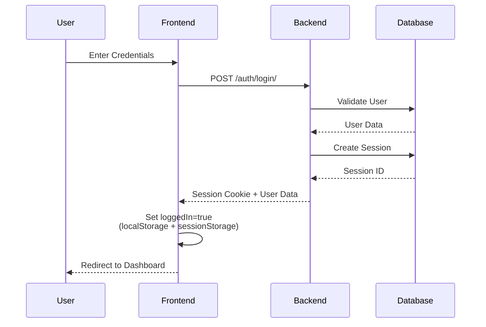
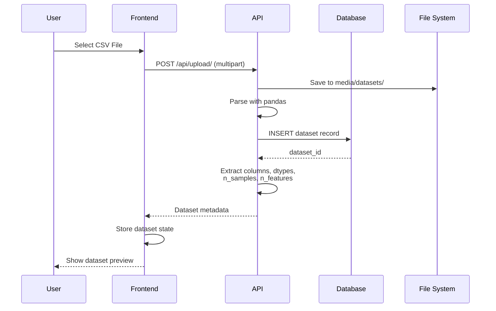
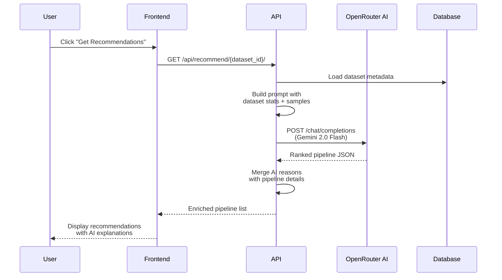
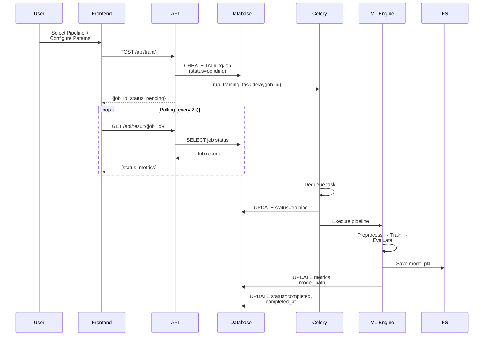
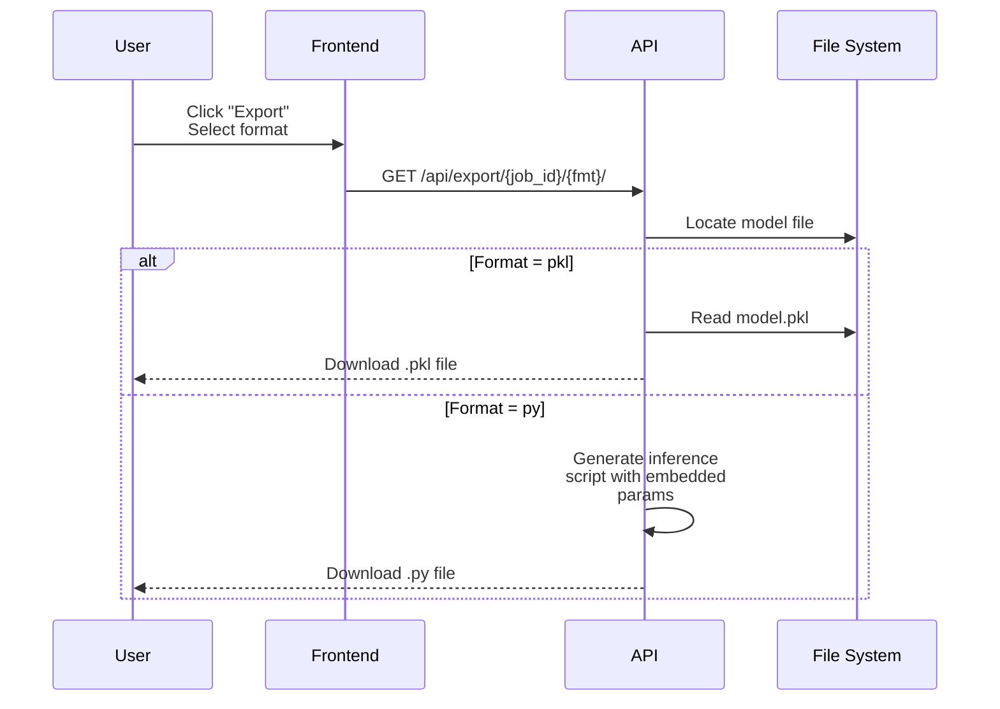
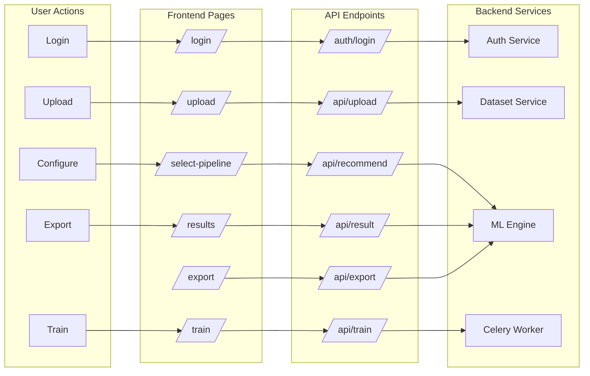
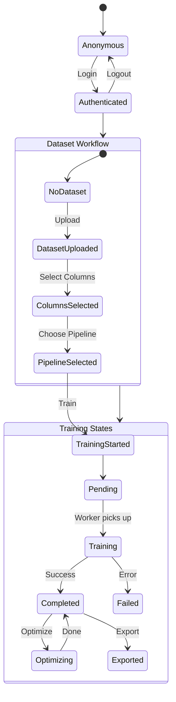
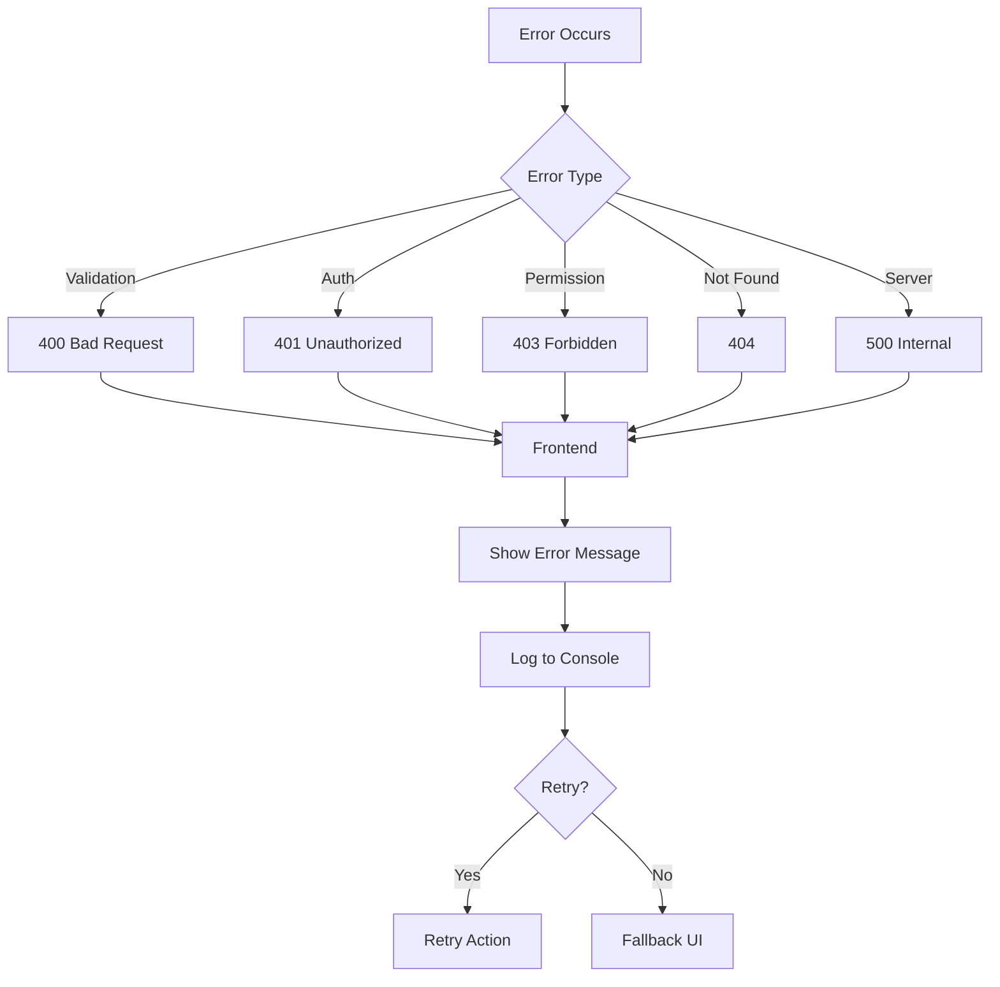

# ML Pipeline Workflow - AutoML Studio

## Complete User Journey



---

## Authentication Flow



---

## Dataset Upload & Analysis Flow



---

## AI Pipeline Recommendation Flow



---

## Training Job Flow



---

## Hyperparameter Optimization Flow

```mermaid
sequenceDiagram
    participant U as User
    participant FE as Frontend
    participant API as API
    participant DB as Database
    participant CEL as Celery
    participant OPT as Optuna

    U->>FE: Click "Optimize"<br/>Set n_trials
    FE->>API: POST /api/optimize/
    API->>DB: Validate job completed
    API->>DB: UPDATE status=optimizing
    API->>CEL: run_optimize_task.delay<br/>(job_id, n_trials)
    API-->>FE: {status: optimizing}

    loop Polling
        FE->>API: GET /api/result/{job_id}/
        API-->>FE: Optimization progress
    end

    CEL->>OPT: Create study
    loop n_trials
        CEL->>OPT: suggest_params()
        CEL->>CEL: Train with params
        CEL->>OPT: report(score)
    end
    CEL->>DB: UPDATE best_params,<br/>optimization_metrics
    CEL->>DB: UPDATE status=completed
```

---

## Model Export Flow



---

## Component Interaction Map



---

## State Management



---

## File Storage Structure

```
media/
├── datasets/           # Uploaded CSV/Excel files
│   └── dataset_1.csv
├── models/             # Trained model pickle files
│   └── model_job_1.pkl
├── image_zips/         # Uploaded image archives
│   └── images_abc123.zip
└── image_clusters/     # Clustering results
    └── job_456/
        ├── clustered_images/
        └── results.json
```

---

## API Rate Limits & Timeouts

| Endpoint | Method | Timeout | Rate Limit |
|----------|--------|---------|------------|
| /auth/login/ | POST | 10s | 10/min |
| /api/upload/ | POST | 60s | 20/min |
| /api/recommend/ | GET | 30s | 10/min |
| /api/train/ | POST | 5s | 10/min |
| /api/result/ | GET | 5s | 60/min (polling) |
| /api/optimize/ | POST | 5s | 5/min |
| /api/export/ | GET | 30s | 10/min |

---

## Error Handling Strategy


